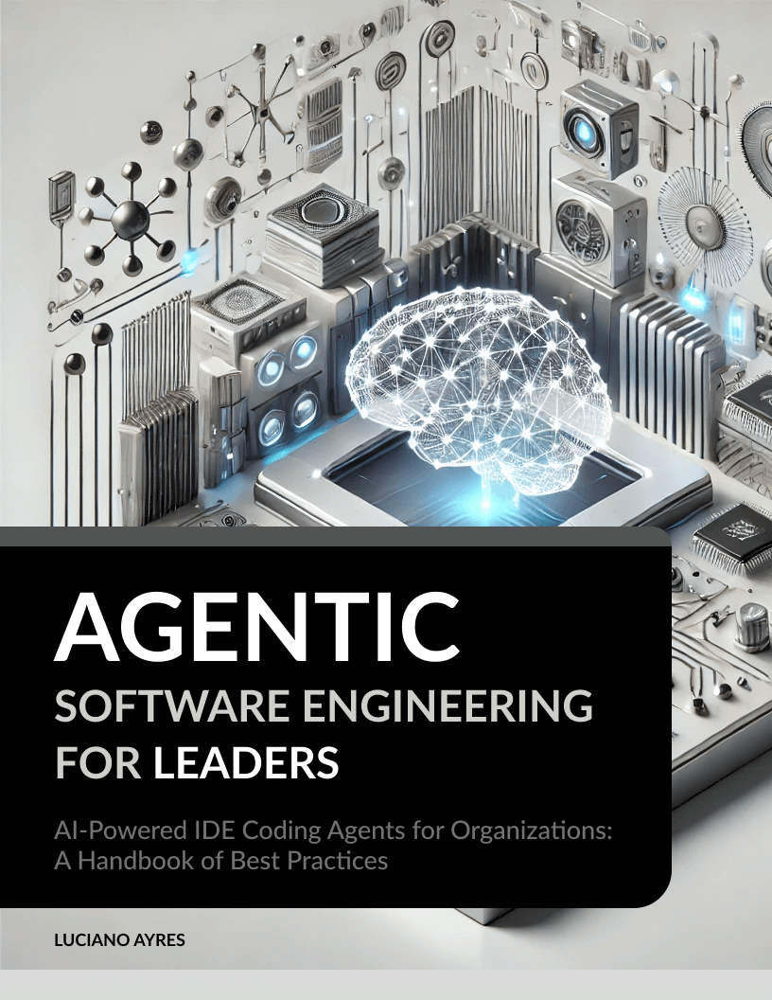

# Agentic Software Engineering for Leaders Handbook

**[Agentic Software Engineering for Leaders](./Agentic_Software_Engineering_for_Leaders_Handbook.md)**  
_AI-Powered IDE Coding Agents for Organizations: A Handbook of Best Practices_

By **[Luciano Ayres](https://www.linkedin.com/in/lucianoayres)**

**First Edition | Published March 23, 2025**  
**Version 1.0**

---

## About the Book 📖

_Agentic Software Engineering for Leaders_ is a comprehensive handbook designed for software engineering managers, aspiring leaders, and CTOs. It provides strategic insights into leveraging AI and autonomous IDEs—such as Cursor and Windsurf—to boost team productivity, enhance code quality, and improve overall developer experience.

This guide walks you through:

- The fundamentals of Agentic Software Engineering and its relevance in modern development.
- How AI is transforming software development workflows.
- Next-generation AI tools that move beyond simple autocomplete to full-fledged autonomous assistance.
- Practical strategies for introducing and integrating AI tools into your team's daily practices.
- Techniques for fostering an AI-literate, innovative, and balanced engineering culture.

---

## How to Read the Book 📚

Access the complete book for free by clicking the link below:

[Read the Book (Markdown)](./Agentic_Software_Engineering_for_Leaders_Handbook.md)

Prefer a PDF version? Download it here:

[Download PDF](./pdf/Agentic_Software_Engineering_for_Leaders_Handbook_by_Luciano_Ayres.pdf)

Or choose the Epub version:

[Download Epub](./epub/Agentic_Software_Engineering_for_Leaders_Handbook_by_Luciano_Ayres.epub)

---

## Table of Contents 📝

1. [Introduction](./_Agentic_Software_Engineering_for_Leaders_Handbook.md#introduction)
2. [Agentic Software Engineering](./_Agentic_Software_Engineering_for_Leaders_Handbook.md#agentic-software-engineering)
   - [What Is Agentic Software Engineering?](./_Agentic_Software_Engineering_for_Leaders_Handbook.md#what-is-agentic-software-engineering)
   - [Why Is Agentic Software Engineering Relevant Today?](./_Agentic_Software_Engineering_for_Leaders_Handbook.md#why-is-agentic-software-engineering-relevant-today)
3. [AI Is Transforming Software Development Workflows](./_Agentic_Software_Engineering_for_Leaders_Handbook.md#ai-is-transforming-software-development-workflows)
4. [Next-Generation AI Tools: From Autocomplete to Autonomous Agents](./_Agentic_Software_Engineering_for_Leaders_Handbook.md#next-generation-ai-tools-from-autocomplete-to-autonomous-agents)
   - [The Autonomous AI Pair Programmer](./_Agentic_Software_Engineering_for_Leaders_Handbook.md#the-autonomous-ai-pair-programmer)
   - [Deep Context Awareness](./_Agentic_Software_Engineering_for_Leaders_Handbook.md#deep-context-awareness)
   - [Agentic Assistance & Developer Flow](./_Agentic_Software_Engineering_for_Leaders_Handbook.md#agentic-assistance--developer-flow)
5. [Introducing AI Tools to Your Team: Strategy and Change Management](./_Agentic_Software_Engineering_for_Leaders_Handbook.md#introducing-ai-tools-to-your-team-strategy-and-change-management)
   - [Prepare the Ground with Education and Buy-In](./_Agentic_Software_Engineering_for_Leaders_Handbook.md#prepare-the-ground-with-education-and-buy-in)
   - [Onboarding and Adoption Tips](./_Agentic_Software_Engineering_for_Leaders_Handbook.md#onboarding-and-adoption-tips)
   - [Measuring the Impact of AI Adoption](./_Agentic_Software_Engineering_for_Leaders_Handbook.md#measuring-the-impact-of-ai-adoption)
6. [Fostering a Culture of AI Literacy and Experimentation](./_Agentic_Software_Engineering_for_Leaders_Handbook.md#fostering-a-culture-of-ai-literacy-and-experimentation)
7. [Balancing Automation with Human Judgment](./_Agentic_Software_Engineering_for_Leaders_Handbook.md#balancing-automation-with-human-judgment)
8. [Leading by Example: How Managers and CTOs Can Leverage AI](./_Agentic_Software_Engineering_for_Leaders_Handbook.md#leading-by-example-how-managers-and-ctos-can-leverage-ai)
9. [Conclusion](./_Agentic_Software_Engineering_for_Leaders_Handbook.md#conclusion)
10. [About the Author](./_Agentic_Software_Engineering_for_Leaders_Handbook.md#about-the-author)
11. [References](./_Agentic_Software_Engineering_for_Leaders_Handbook.md#references)

---

## Contributing & Feedback 🤝

If you have any suggestions, corrections, or improvements, please feel free to submit an issue or pull request. Your feedback is highly appreciated!

---

## License 📄

This work is licensed under the [Creative Commons Attribution-ShareAlike 4.0 International License](https://creativecommons.org/licenses/by-sa/4.0/).
